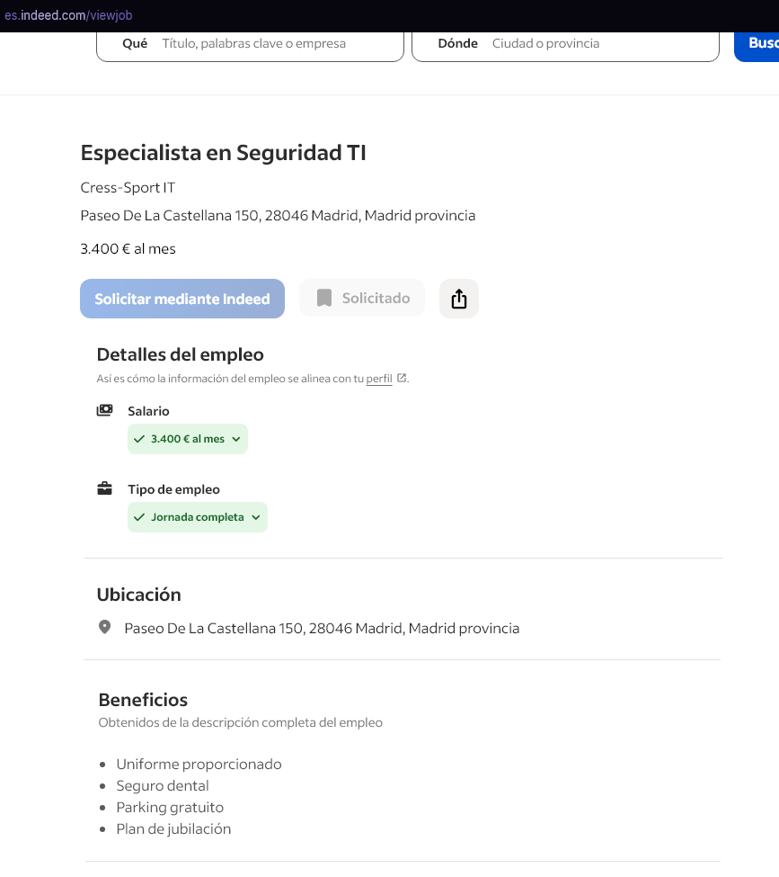
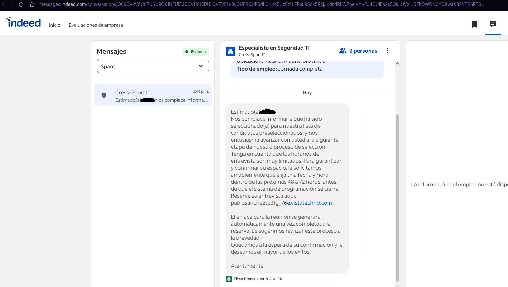
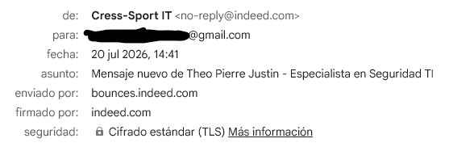
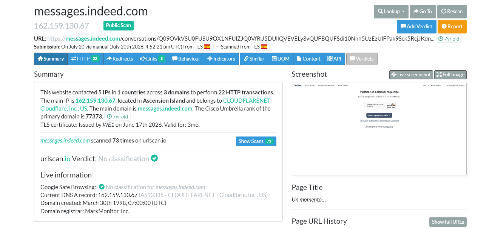
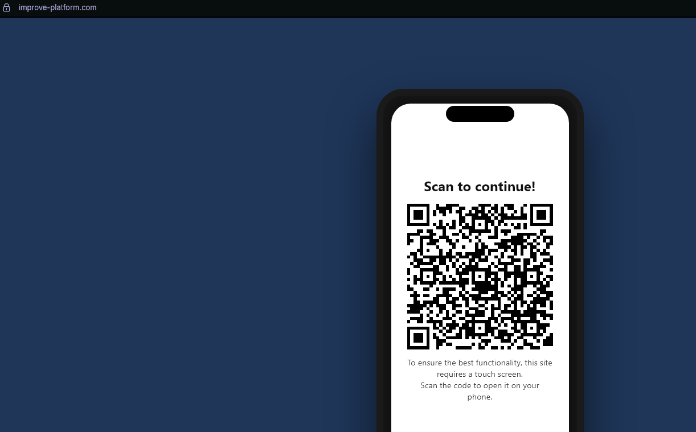
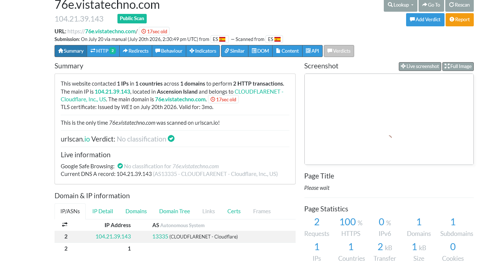

# Phishing Case: Suplantacion de Identidad de Indeed y Cress-Sport IT

**Autor:** Pablo Rodriguez Sanchez
**Fecha:** 20 de julio de 2026
**Clasificacion:** Phishing / Ingenieria Social / Abuso de Plataforma
**Estado:** Reportado a la plataforma afectada

---

## Resumen Ejecutivo

Este documento describe un intento de phishing altamente sofisticado que explota la propia plataforma de Indeed para enviar mensajes fraudulentos a candidatos que se han postulado a ofertas de empleo reales. El ataque combina:

- Abuso del sistema de mensajeria de Indeed
- Suplantacion de una empresa real (Cress-Sport IT)
- Tacticas de ingenieria social (urgencia, preseleccion)
- Tecnicas de evasion (codigos QR, dominios efimeros)
- Uso de infraestructura Cloudflare para ocultamiento

El caso fue detectado a tiempo y no se produjo la instalacion del software malicioso ni el compromiso del dispositivo de la victima.

**Este es un caso especialmente peligroso porque el mensaje se envio a traves de los canales legitimos de Indeed, lo que dificulta su deteccion.**

---

## Vector de Ataque

| Elemento | Descripcion |
|----------|-------------|
| Canal de entrada | Sistema de mensajeria de Indeed (legitimo) |
| Remitente visible | Cress-Sport IT <no-reply@indeed.com> |
| Nombre del reclutador | Theo Pierre Justin |
| Asunto | Mensaje nuevo de Theo Pierre Justin - Especialista en Seguridad TI |
| Dominio de envio | bounces.indeed.com (legitimo) |
| Dominio del mensaje | messages.indeed.com (legitimo) |
| URL maliciosa en el mensaje | pablosanchez23fg.76evistatechno.com |
| URL intermedia (QR) | improve-platform.com |
| URL final (APK) | 76e.vistatechno.com |
| IP del servidor | 104.21.39.143 (Cloudflare, EE.UU.) |
| Objetivo final | Instalacion de app de acceso remoto / robo de identidad |

---

## Desarrollo del Ataque

### 1. Postulacion inicial (legitima)

La victima se postulo a una oferta de empleo publicada en la plataforma Indeed para la empresa Cress-Sport IT, con sede en Madrid. La oferta correspondia a un puesto de Especialista en Seguridad TI con un salario de 3.400 euros al mes.

### 2. El mensaje fraudulento a traves de Indeed

Dias despues de la postulacion, la victima recibio un mensaje a traves del sistema de mensajeria interno de Indeed. El mensaje aparecia en la bandeja de entrada de Indeed como cualquier comunicacion legitima de un empleador.

**Metadatos del mensaje:**

| Campo | Valor |
|-------|-------|
| Remitente | Cress-Sport IT <no-reply@indeed.com> |
| Nombre del reclutador | Theo Pierre Justin |
| Asunto | Mensaje nuevo de Theo Pierre Justin - Especialista en Seguridad TI |
| Enviado por | bounces.indeed.com (legitimo) |
| Firmado por | indeed.com (legitimo) |

**Contenido del mensaje:**

"Estimado(a) Nos complace informar que ha sido seleccionado(a) para nuestra lista de candidatos preseleccionados, y nos entusiasma avanzar con usted a la siguiente etapa de nuestro proceso de seleccion. Tenga en cuenta que los horarios de entrevista son muy limitados. Para garantizar y confirmar su espacio, le solicitamos amablemente que elija una fecha y hora dentro de las proximas 48 a 72 horas, antes de que el sistema de programacion se cierre. Reserve su entrevista aqui: pablosanchez23fg.76evistatechno.com"

"El enlace para la reunion se generara automaticamente una vez completada la reserva. Le sugerimos realizar este proceso a la brevedad. Quedamos a la espera de su confirmacion y le deseamos el mayor de los exitos."

"Atentamente,"

### 3. Correo electronico de notificacion

Ademas del mensaje en la plataforma, la victima recibio una copia del mensaje por correo electronico, notificandole que tenia un nuevo mensaje en Indeed.

### 4. Analisis del enlace de Indeed

El enlace del mensaje apuntaba a una URL legitima de Indeed:
https://messages.indeed.com/conversaciones/[ID_LARGO]

**Analisis tecnico del dominio de Indeed (urlscan.io):**

| Parametro | Resultado |
|-----------|-----------|
| URL | https://messages.indeed.com/ |
| IP | 162.159.130.67 (Cloudflare, EE.UU.) |
| Ubicacion | Isla Ascension |
| Antiguedad del dominio | 7 años (creado en 1998) |
| Certificado SSL | Emitido por WE1, valido por 3 meses |
| Titulo de la pagina | "Un momento..." |
| Estado HTTP | 403 (acceso denegado) |
| Veredicto urlscan.io | Sin clasificacion |

Observacion: El enlace de Indeed fue escaneado en urlscan.io el 20 de julio de 2024 (un año antes del ataque), lo que indica que los estafadores podrian haber estado probando su infraestructura con mucha antelacion.

### 5. La URL maliciosa en el mensaje

El mensaje contenía el siguiente enlace fraudulento:
pablosanchez23fg.76evistatechno.com

**Observaciones sobre esta URL:**
- Utiliza un subdominio personalizado (pablosanchez23fg) para simular ser un enlace de reserva de entrevista
- El dominio base 76evistatechno.com (variante de vistatechno.com) fue registrado para la estafa
- La URL no incluye el protocolo https://, lo que es inusual en comunicaciones legitimas

### 6. Redireccion a la pagina QR

Al hacer clic en el enlace, la victima era redirigida a una pagina intermedia:
improve-platform.com

Esta pagina mostraba:

"Scan to continue! To ensure the best functionality, this site requires a touch screen. Scan the code to open it on your phone."

**Analisis tecnico:**

| Parametro | Resultado |
|-----------|-----------|
| URL | https://improve-platform.com/ |
| IP | 104.21.39.143 (Cloudflare) |
| Ubicacion | Isla Ascension |
| Antiguedad del dominio | 17 SEGUNDOS |
| Certificado SSL | Emitido el mismo dia |
| Titulo | "Please wait" |

**Tactica de evasion:** El codigo QR traslada a la victima del ordenador al telefono, dificultando el analisis de la URL y aumentando el riesgo de instalacion de apps maliciosas.

### 7. Escaneo del codigo QR (telefono)

Al escanear el codigo QR con el telefono, la victima era redirigida a una nueva URL en el dispositivo movil:
76e.vistatechno.com

**Flujo de redireccion:**
Enlace en el mensaje de Indeed
pablosanchez23fg.76evistatechno.com
↓

Pagina QR (improve-platform.com)
"Scan to continue!"
 05-pagina-qr.png
↓

Escaneo del QR con el telefono
↓

Redireccion en el movil a 76e.vistatechno.com
(pagina fraudulenta con logos de Indeed)
↓

La pagina solicita descargar una APK
(supuestamente "Indeed Interview")
↓

Solicita VPN + codigo de invitacion
↓

COMPROMISO DEL DISPOSITIVO (si se completa)

### 8. Pagina fraudulenta final

Al escanear el QR, la victima accedia a:
76e.vistatechno.com

Esta pagina:
- Utilizaba logos e imagen corporativa de Indeed
- Simulaba ser el portal oficial de reserva de entrevistas
- Solicitaba la descarga de una aplicacion ("Indeed Interview")
- Pedia conectarse a una VPN e introducir un codigo de invitacion

**Analisis con PowerDMARC:**

| Parametro | Resultado |
|-----------|-----------|
| Indice de Confianza | 100 / 100 (NO detectado) |
| OpenPhish | No detectado |
| Abuse.ch URLhaus | No detectado |
| Google Safe Browsing | No detectado |

Nota de PowerDMARC: "Un resultado limpio significa que no se ha detectado ninguna amenaza conocida en el momento de la comprobacion. Aparecen constantemente nuevas paginas de phishing; en caso de duda, no las visites."

---

## Analisis de Infraestructura

### Comparativa de dominios

| Dominio | Antiguedad | Proposito | Estado |
|---------|-----------|-----------|--------|
| messages.indeed.com | 7 años | Plataforma legitima de Indeed | Legitimo |
| pablosanchez23fg.76evistatechno.com | Desconocida | Enlace del mensaje | Fraudulento |
| improve-platform.com | 17 segundos | Pagina con QR | Fraudulento |
| 76e.vistatechno.com | Desconocida | Pagina final (APK) | Fraudulento |

### Mapa completo del ataque
Oferta de empleo publicada en Indeed (Cress-Sport IT)
01-oferta-empleo.png
↓

02-Victima se postula (acto legitimo)
↓

03-Los estafadores (supuestamente "Theo Pierre Justin")
envian mensaje a traves del sistema de Indeed
 De: Cress-Sport IT no-reply@indeed.com
 Via: bounces.indeed.com (legitimo)
 02-mensaje-indeed.png / 03-correo-electronico.png
↓

04-La victima ve el mensaje en su bandeja de Indeed
(parece legitimo porque esta en la plataforma)
↓

05-El mensaje contiene un enlace a:
pablosanchez23fg.76evistatechno.com
↓

06-Redireccion a improve-platform.com
 17 segundos de antiguedad
 05-pagina-qr.png
↓

07-Pagina QR: "Scan to continue!"
↓

08-Escaneo con telefono → 76e.vistatechno.com
 PowerDMARC: 100/100 (NO detectado)
 06-url-maliciosa-analisis.png
↓

09-Pagina con logos de Indeed (en el movil)
Solicita descargar APK + VPN + codigo
↓

10-COMPROMISO DEL DISPOSITIVO (si se completa)

---

## Señales de Alerta Identificadas

### 1. El mensaje llega a traves de Indeed (ABUSO DE PLATAFORMA)

El mensaje fue enviado a traves del sistema legitimo de mensajeria de Indeed. Esto es especialmente peligroso porque:

- La victima confia en los mensajes de Indeed
- El mensaje aparece en la bandeja de entrada de Indeed
- Los metadatos del correo (bounces.indeed.com, firmado por: indeed.com) son legitimos

Conclusion: Los estafadores abusaron del sistema de Indeed para enviar mensajes fraudulentos. Indeed permitio que un estafador enviara un mensaje a traves de su plataforma suplantando a una empresa.

### 2. El nombre del reclutador "Theo Pierre Justin"

El nombre del supuesto reclutador es "Theo Pierre Justin". No hay informacion publica que vincule este nombre con Cress-Sport IT.

### 3. Tacticas de urgencia y presion

- "los horarios de entrevista son muy limitados"
- "dentro de las proximas 48 a 72 horas"
- "antes de que el sistema de programacion se cierre"

### 4. URL sospechosa en el mensaje

La URL pablosanchez23fg.76evistatechno.com es sospechosa porque:
- El subdominio pablosanchez23fg parece una cuenta personal
- El dominio 76evistatechno.com no esta relacionado con Indeed ni Cress-Sport
- No utiliza https:// (protocolo seguro)

### 5. Codigo QR como tecnica de evasion

El QR traslada a la victima del ordenador al telefono, donde:
- Es mas dificil analizar la URL
- Es mas facil instalar apps maliciosas (APK)
- Se evaden sistemas de seguridad de escritorio

### 6. Proceso de entrevista atipico

| Proceso legitimo | Proceso fraudulento |
|------------------|---------------------|
| Zoom, Teams, Meet | App desconocida (APK) |
| Enlace directo | QR + redirecciones |
| Sin instalacion | VPN + codigo de invitacion |
| Sin acceso remoto | Solicitan control del dispositivo |

### 7. Beneficios inusuales en la oferta

"Uniforme proporcionado" para un puesto de Especialista en Seguridad TI es incompatible con el perfil.

---

## Analisis del nombre "Theo Pierre Justin"

| Elemento | Analisis |
|----------|----------|
| Nombre | Theo Pierre Justin |
| Posible origen | Frances (coincide con CRESS Sport, empresa francesa) |
| Vinculacion con Cress-Sport | No hay informacion publica |
| Autenticidad | No verificable; probablemente inventado |

---

## Analisis de la empresa Cress-Sport IT

| Elemento | Realidad |
|----------|----------|
| CRESS Sport (matriz) | Empresa real fundada en 1995 en Talence (Francia), especializada en material deportivo |
| Cress-Sport IT (filial) | No existe registro publico de esta filial en España |
| Direccion | Paseo de la Castellana 150, 28046 Madrid (ubicacion real pero sin confirmacion) |
| Beneficios | Incluye "uniforme" para un puesto IT (inconsistente) |

Conclusion: La oferta fue creada por los estafadores utilizando el nombre de una empresa real para dar credibilidad.

---

## Evidencias Recopiladas

| Evidencia | Descripcion | Estado |
|-----------|-------------|--------|
| Oferta de empleo | Publicada en Indeed para Cress-Sport IT | 01-oferta-empleo.png |
| Mensaje en Indeed | Captura del mensaje en la bandeja de Indeed | 02-mensaje-indeed.png |
| Correo electronico | Copia del mensaje con metadatos | 03-correo-electronico.png |
| Analisis urlscan.io | Escaneo de messages.indeed.com | 04-url-indeed-analisis.png |
| Pagina QR | improve-platform.com (17 segundos) | 05-pagina-qr.png |
| Analisis PowerDMARC | Indice 100/100 (NO detectado) | 06-url-maliciosa-analisis.png |

---

## Medidas de Mitigacion

### Para la victima (aplicadas)

- No se descargo ni instalo la aplicacion
- No se introdujo ningun codigo
- No se compartio acceso al dispositivo
- Se reporto a Indeed
- Se documento todo el proceso

### Recomendaciones para Indeed

1. Verificar la identidad de los empleadores antes de permitir el envio de mensajes a candidatos
2. Implementar alertas para mensajes que contengan enlaces sospechosos
3. Revisar ofertas de empresas que no tengan historial verificado
4. Anadir advertencias visibles en mensajes de empleadores no verificados

### Recomendaciones para candidatos

1. Verificar siempre la empresa antes de hacer clic en enlaces
2. Desconfiar de las urgencias - Las empresas serias no presionan asi
3. No descargar apps externas - Las entrevistas usan Zoom, Teams o Meet
4. Nunca compartir acceso remoto
5. No escanear QR de fuentes desconocidas
6. Verificar la oferta en la plataforma oficial
7. Contactar a la empresa por canales oficiales

---

## Lecciones Aprendidas

### Lo que hizo bien la victima

- Detecto la inconsistencia en el proceso
- Reconocio las tacticas de presion
- Consulto antes de actuar
- Documento todo el proceso
- No completo los pasos solicitados

### Lo que los atacantes hicieron bien (desde su perspectiva)

- Abusaron del sistema de mensajeria de Indeed (el mensaje parecia legitimo)
- Suplantaron una empresa real (Cress-Sport IT)
- Crearon urgencia
- Usaron logos creibles
- Disenaron flujo logico
- Explotaron una postulacion real
- Usaron QR como evasion
- Usaron Cloudflare para ocultar su infraestructura
- Dominios NO catalogados como maliciosos

---

## Conclusiones

Este caso de phishing destaca por su sofisticacion sin precedentes al combinar:

1. Abuso del sistema de mensajeria de Indeed (mensaje enviado a traves de la plataforma legitima)
2. Suplantacion de una empresa real (Cress-Sport IT)
3. Postulacion real de la victima (expectativa)
4. Nombre de reclutador inventado ("Theo Pierre Justin")
5. Tacticas de presion para evitar el pensamiento critico
6. Codigo QR como tecnica de evasion
7. Dominios de vida efimera (17 segundos)
8. Dominios NO catalogados en bases de datos de amenazas
9. Servicios de proxy (Cloudflare) para ocultamiento
10. Descarga de APK maliciosa en el dispositivo movil

### La paradoja de la seguridad

El mensaje se envio a traves del sistema LEGITIMO de Indeed.
El enlace de Indeed era LEGITIMO.
Y sin embargo, el contenido era FRAUDULENTO.

Esto demuestra que:
- Incluso las plataformas legitimas pueden ser abusadas
- Un mensaje en la bandeja de Indeed no garantiza su autenticidad
- La confianza en la plataforma puede ser explotada
- El factor humano sigue siendo la mejor defensa

**La diferencia entre caer o no fue prestar atencion a los detalles.**

---

## Referencias

- [Indeed Centro de Seguridad](https://www.indeed.com/security)
- [Incibe - Phishing](https://www.incibe.es/protege-tu-empresa/amenazas/phishing)
- [urlscan.io](https://urlscan.io/)
- [PowerDMARC](https://powerdmarc.com/)
- [CRESS Sport (empresa real)](https://www.cress-sport.com/)

---

## Indicadores de Compromiso (IOCs)

Disponibles en [iocs.txt](iocs.txt)

---

*Este writeup ha sido elaborado con fines educativos y de concienciacion sobre ciberseguridad.*

**#Phishing #Cybersecurity #Indeed #CressSportIT #SecurityAwareness #JobScam #OSINT #SocialEngineering #Cloudflare #urlscan #PowerDMARC #PlatformAbuse**
